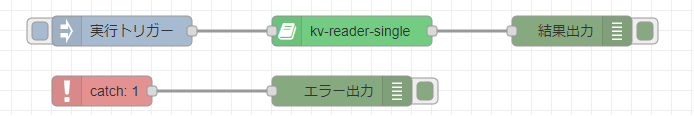
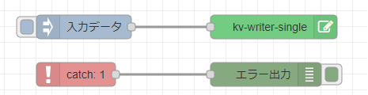
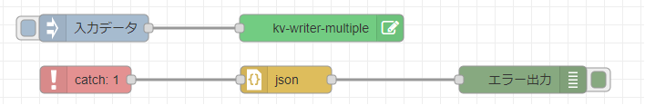
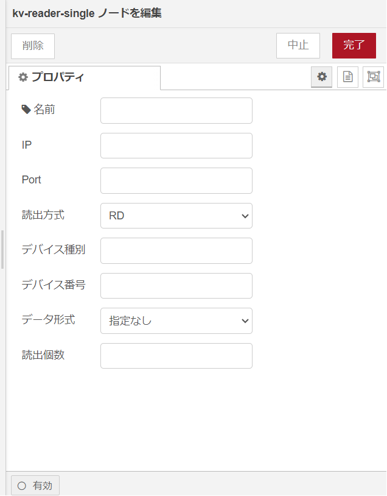
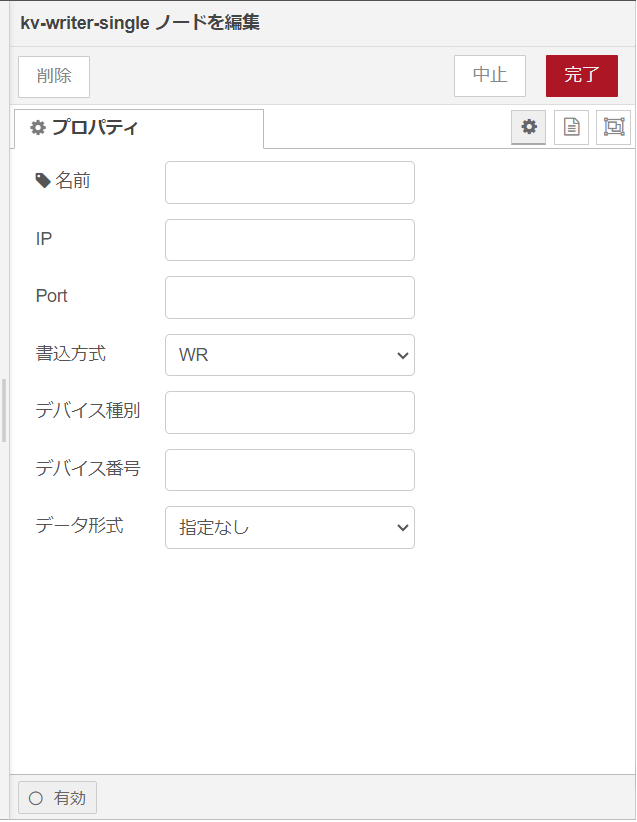
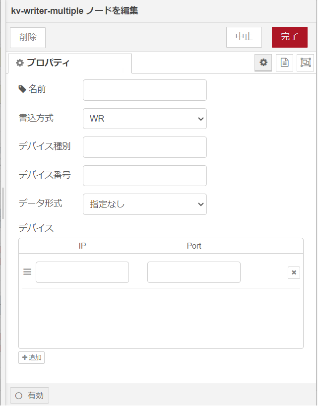

# node-red-kv

## 目次
* [概要](#概要)
* [機能](#機能)
* [Deployment 設定値](#deployment-設定値)
  * [環境変数](#環境変数)
  * [Create Option](#create-option)
* [ログ出力内容](#ログ出力内容)
  * [kv-reader-single](#kv-reader-single)
  * [kv-writer-single](#kv-writer-single)
  * [kv-writer-multiple](#kv-writer-multiple)
* [Node Specification](#node-specification)
  * [kv-reader-single](#Node-Specification-kv-reader-single)
  * [kv-writer-single](#Node-Specification-kv-writer-single)
  * [kv-writer-multiple](#Node-Specification-kv-writer-multiple)
* [Feedback](#feedback)
* [LICENSE](#license)

## 概要
node-red-kvは、下記処理を行うNode-REDのカスタムノードです。

#### 1. kv-reader-single

&emsp;・デバイスのデータ読出

#### 2. kv-writer-single

&emsp;・デバイスへのデータ書込

#### 3. kv-writer-multiple

&emsp;・デバイスへのデータ書込（IP/Port複数版）

## 機能

kvデバイスに対しデータの読出や書き込みを行う機能。<br>
以下のノードを含む。

* kv-reader-single デバイスからデータ読出を行う。<br>


* kv-writer-single デバイスへデータ書き込みを行う。<br>


* kv-writer-single 複数デバイスへデータ書き込みを行う。<br>



## Deployment 設定値

### 環境変数

#### 環境変数の値

(なし)

### Create Option

#### Create Option の値

(なし)

## ログ出力内容

### kv-reader-single

| LogLevel | 出力概要 |
| -------- | -------- |
| error    | コマンド送信時エラー発生     |
| warn     | 無し        |
| info     | kvデバイス接続<br>コマンド送信<br>レスポンス受信<br>コマンド送信時リトライ |
| debug    | 無し    |
| trace    | 無し       |

### kv-writer-single

| LogLevel | 出力概要 |
| -------- | -------- |
| error    | コマンド送信時エラー発生     |
| warn     | 無し        |
| info     | kvデバイス接続<br>コマンド送信<br>レスポンス受信<br>コマンド送信時リトライ |
| debug    | 無し    |
| trace    | 無し       |

### kv-writer-multiple

| LogLevel | 出力概要 |
| -------- | -------- |
| error    | コマンド送信時エラー発生     |
| warn     | 無し        |
| info     | kvデバイス接続<br>コマンド送信<br>レスポンス受信<br>コマンド送信時リトライ |
| debug    | 無し    |
| trace    | 無し       |

## Node Specification

<a id="Node-Specification-kv-reader-single"></a>

### kv-reader-single

* 機能概要

  デバイスからのデータ読出を行う。<br>
  ノードから出力されるmsg.payloadにはデバイスから読出したデータがそのまま格納されるため、<br>
  後続ノードにてデータの分割や結合を行うこと。

* プロパティ

  

  | プロパティ | Type        | Required | Description          |
  | ---------- | ----------- | -------- | -------------------- |
  | 名前       | string      | &nbsp;   | ノードの表示名を設定。 |
  | IP         | string      | 〇       | デバイスIP。           |
  | Port       | string      | 〇   | ポート番号。    |
  | 読出方式    | option      | 〇   | 読出方式を選択する。<br> [RD,RDS] <br>RD：データ読出。RDS：連続データ読出。                 |
  | デバイス種別 | string      | 〇   | デバイス種別。                    |
  | デバイス番号 | string      | 〇   | デバイス番号。                    |
  | データ形式   | select      | 〇   | データ形式。※KVマニュアルを確認し種別に応じて変更する。<br>[.U,.S,.D,.L,.H,指定なし]<br>.U：10進数16ビット符号なし。<br>.S：10進数16ビット符号あり。<br>.D：10進数32ビット符号なし。<br>.L：10進数16ビット符号あり。<br>.H：16進数16ビット。   |
  | 読出個数    | string      | 〇   | 読み出す個数。                    |

* エラー／例外

  無し

* 使用例１

  [プロパティ]

  | プロパティ    | Type   | Value   |
  | ------------ | ------ | ------- |
  | IP           | string | デバイスIP     |
  | Port         | string   | ポート番号  |
  | 読出方式     | option    | RD       |
  | デバイス種別 | string    | DM       |
  | デバイス番号 | string    | 10000       |
  | データ形式   | select    | .U       |
  | 読み出し個数 | string    | 1       |

  [入力メッセージ]

 (なし。トリガーとしてのみ使用)

  [出力メッセージ]

  ```json
  {
    "_msgid":"メッセージid",
    "payload":"00090"
  }
  ```

* 使用例2

  [プロパティ]

  | プロパティ    | Type   | Value   |
  | ------------ | ------ | ------- |
  | IP           | string | デバイスIP     |
  | Port         | string   | ポート番号  |
  | 読出方式     | option    | RDS       |
  | デバイス種別 | string    | DM       |
  | デバイス番号 | string    | 10000       |
  | データ形式   | select    | .U       |
  | 読み出し個数 | string    | 2       |

  [入力メッセージ]

 (なし。トリガーとしてのみ使用)

  [出力メッセージ]

  ```json
  {
    "_msgid":"メッセージid",
    "payload":"00315 0000"
  }
  ```

<a id="Node-Specification-kv-writer-single"></a>

### kv-writer-single

* 機能概要

  デバイスへのデータ書き込みを行う。<br>
  ノードへの入力msg.payloadには、dataをキーとして書き込みデータ本文を格納すること。

* プロパティ

  

  | プロパティ | Type        | Required | Description          |
  | ---------- | ----------- | -------- | -------------------- |
  | 名前       | string      | &nbsp;   | ノードの表示名を設定。 |
  | IP         | string      | 〇       | デバイスIP。           |
  | Port       | string      | 〇   | ポート番号。    |
  | 書込方式    | option      | 〇   | 書込方式を選択する。<br> [WR,WRS] <br>WR：データ書込。WRS：連続データ書込。                 |
  | デバイス種別 | string      | 〇   | デバイス種別。                    |
  | デバイス番号 | string      | 〇   | デバイス番号。                    |
  | データ形式   | select      | 〇   | データ形式。※KVマニュアルを確認し種別に応じて変更する。<br>[.U,.S,.D,.L,.H,指定なし]<br>.U：10進数16ビット符号なし。<br>.S：10進数16ビット符号あり。<br>.D：10進数32ビット符号なし。<br>.L：10進数16ビット符号あり。<br>.H：16進数16ビット。   |

* エラー／例外

  無し

* 使用例１

  [プロパティ]

  | プロパティ | Type   | Value   |
  | ---------- | ------ | ------- |
  | IP           | string | デバイスIP     |
  | Port         | string   | ポート番号  |
  | 書込方式     | option    | WR       |
  | デバイス種別 | string    | DM       |
  | デバイス番号 | string    | 10000       |
  | データ形式   | select    | .S       |

  [入力メッセージ]

  ```json
  {
    "data": [
        "+15025",
        "-05400",
        "200"
    ]
  }
  ```

  [出力メッセージ]

  (なし)

<a id="Node-Specification-kv-writer-multiple"></a>

### kv-writer-multiple

* 機能概要

  デバイスへのデータ書き込みを行う。<br>
  ノードへの入力msg.payloadには、dataをキーとして書き込みデータ本文を格納すること。

* プロパティ

  

  | プロパティ | Type        | Required | Description          |
  | ---------- | ----------- | -------- | -------------------- |
  | 名前       | string      | &nbsp;   | ノードの表示名を設定。 |
  | 書込方式    | option      | 〇   | 書込方式を選択する。<br> [WR,WRS] <br>WR：データ書込。WRS：連続データ書込。                 |
  | デバイス種別 | string      | 〇   | デバイス種別。                    |
  | デバイス番号 | string      | 〇   | デバイス番号。                    |
  | データ形式   | select      | 〇   | データ形式。※KVマニュアルを確認し種別に応じて変更する。<br>[.U,.S,.D,.L,.H,指定なし]<br>.U：10進数16ビット符号なし。<br>.S：10進数16ビット符号あり。<br>.D：10進数32ビット符号なし。<br>.L：10進数16ビット符号あり。<br>.H：16進数16ビット。   |
  | デバイス   | list      | 〇   | デバイス情報リスト。 |
  | &nbsp;IP         | string      | 〇       | デバイスIP。           |
  | &nbsp;Port       | string      | 〇   | ポート番号。    |

* エラー／例外

  無し

* 使用例１

  [プロパティ]

  | プロパティ | Type   | Value   |
  | ---------- | ------ | ------- |
  | 書込方式     | option    | WR       |
  | デバイス種別 | string    | DM       |
  | デバイス番号 | string    | 10000       |
  | データ形式   | select    | .S       |
  | デバイス     |           |          |
  | &nbsp;IP    | string | デバイスIP     |
  | &nbsp;Port  | string   | ポート番号  |


  [入力メッセージ]

  ```json
  {
    "data": [
        "+15025",
        "-05400",
        "200"
    ]
  }
  ```

  [出力メッセージ]

  (なし)

## Feedback
お気づきの点があれば、ぜひIssueにてお知らせください。

## LICENSE
node-red-kv is licensed under the MIT License, see the [LICENSE](LICENSE) file for details.